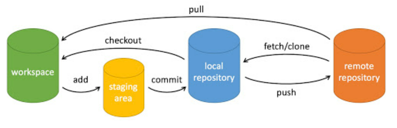

#### Git基本操作

图示：

- **workspace**：工作区

- **staging area**：暂存区/缓存区

- **local repository**：版本库或本地仓库

- **remote repository**：远程仓库

  

##### 创建仓库命令

| 命令        | 说明                                   |
| :---------- | :------------------------------------- |
| `git init`  | 初始化仓库                             |
| `git clone` | 拷贝一份远程仓库，也就是下载一个项目。 |

##### 提交与修改

| 命令         | 说明                                     |
| :----------- | :--------------------------------------- |
| `git add`    | 添加文件到仓库                           |
| `git status` | 查看仓库当前的状态，显示有变更的文件。   |
| `git diff`   | 比较文件的不同，即暂存区和工作区的差异。 |
| `git commit` | 提交暂存区到本地仓库。                   |
| `git reset`  | 回退版本。                               |
| `git rm`     | 删除工作区文件。                         |
| `git mv`     | 移动或重命名工作区文件。                 |

##### 提交日志

| 命令               | 说明                                 |
| :----------------- | :----------------------------------- |
| `git log`          | 查看历史提交记录                     |
| `git blame <file>` | 以列表形式查看指定文件的历史修改记录 |

##### 远程操作

| 命令         | 说明               |
| :----------- | :----------------- |
| `git remote` | 远程仓库操作       |
| `git fetch`  | 从远程获取代码库   |
| `git pull`   | 下载远程代码并合并 |
| `git push`   | 上传远程代码并合并 |

##### 分支操作

| 命令           | 说明     |
| :------------- | :------- |
| `git branch`   | 创建分支 |
| `git checkout` | 切换分支 |
| `git merge`    | 合并分支 |

