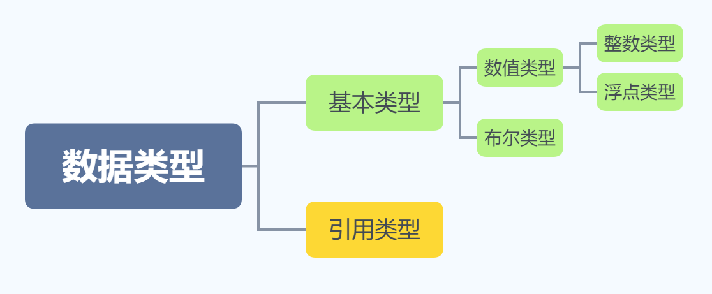

### 1. 数据类型与运算符

#### 数据类型

分为基本类型和引用类型




##### 基本类型

|         |     类型     | 字节数 |         数值范围          |    默认值    |  包装类   |
| :-----: | :----------: | :----: | :-----------------------: | :----------: | :-------: |
|  byte   |    字节型    |   1    |     ($-2^7$​​，$2^7-1$​​​)     |      0       |   Byte    |
|  short  |    短整型    |   2    | （$-2^{15}，$​​​​$2^{15}-1$​​​） |      0       |   Short   |
|   int   |     整型     |   4    | （$-2^{31}$​，$2^{31}-1$） |      0       |  Integer  |
|  long   |    长整型    |   8    |  ($-2^{63}$，$2^{63}-1$)  |      0       |   Long    |
|  char   |    字符型    |   2    |     ($0$，$2^{15}-1$)     | \u0000（空） | Character |
|  float  | 单精度浮点型 |   4    |  ($-2^{31}$，$2^{31}-1$)  |     0.0      |   Float   |
| double  | 双精度浮点型 |   8    |  ($-2^{63}$，$2^{63}-1$)  |     0.0      |  Double   |
| boolean |    布尔型    |  4或1  |        false,true         |    false     |  Boolean  |

##### 引用类型

​		引用数据类型在被创建时，首先要在栈上给其引用（句柄）分配一块内存，而对象的具体信息都存储在堆内存上，然后由栈上面的引用指向堆中对象的地址。

​		引用类型有：数组、接口、类、Null。

==**注意点：**==

1. `int` 是最常用的整数类型，通常情况下，直接给出一个整数值默认就是 `int` 类型。

   >如果直接将一个较小的整数值（在 `byte` 或 `short` 的表数范围内 ）赋给一个 `byte` 或 `short` 变量，系统会自动把这个整数值当作 `byte` 或 `short`  类型来处理。

   >如果使用一个巨大的整数值 （超过了 `int` 的表数范围）时，Java不会自动把这个整数值当作 `long` 类型来处理。如果希望系统将其当作 `long` 类型来处理，需要在其整数值后加上 `L` 作为后缀。

2. 整数的四种表现形式。

   ```java
   //以0开头的整数值是八进制整数
   int octalValue = 013;
   //以0X开头的整数值是十六进制整数
   int hexValue1 = 0X13;
   int hexValue2 = 0Xff;
   //以0B开头的整数值是二进制整数（java7新增的支持）
   int binValue = 0B00000011;
   ```


   3. 因为Java浮点类型使用二进制数据的科学计数法来表示浮点数。因此可能不能精确的表示一个浮点数。如果开发者需要精确表示一个浮点数,则可以考虑 `BigDecimal`类。

      >float类型: 第一位是符号位，接下来8位代表指数，再接下来的23位表示尾数。

      >double类型: 第一位是符号位，接下里11位代表指数，再接下来的52位表示位数。

        4. 表达式类型的自动提升规则

       >所有的 `Byte` 类型，`short` 类型和 `char` 类型将被提升到 `int` 类型。

       >整个算数表达式的数据类型自动提升到与表达式中最高等级操作数相同的类型。


#### 运算符


##### 算数运算符

| 运算符 | 运算 |      例子       | 结果 |
| :----: | :--: | :-------------: | :--: |
|   +    |  加  |       7+2       |  9   |
|   -    |  减  |       7-2       |  5   |
|   *    |  乘  |       7*2       |  14  |
|   /    |  除  |       7/2       |  3   |
|   %    | 取余 |       7%2       |  1   |
|   ++   | 自加 | i=7；++i；i++； | 8；7 |
|   --   | 自减 | i=7；--7；7--； | 6；7 |

##### 赋值运算符

| 运算符 |   运算   |        例子         | 结果 |
| :----: | :------: | :-----------------: | :--: |
|   =    |   赋值   |       i = 10;       |  /   |
|   +=   |  加等于  | int i =10；i += 5； |  15  |
|   -=   |  减等于  | int i =10；i -= 5； |  5   |
|   *=   |  乘等于  | int i =10；i *= 5； |  50  |
|   /=   |  除等于  | int i =10；i /= 5； |  2   |
|   %=   | 取余等于 | int i =10；i %= 5； |  0   |

##### 比较运算符

| 运算符 |   运算   |  例子  | 结果  |
| :----: | :------: | :----: | :---: |
|   >    |   大于   | 2 > 1  | true  |
|   >=   | 大于等于 | 2 >= 1 | true  |
|   ==   |   等于   | 2 == 1 | false |
|   !=   |  不等于  | 2 != 1 | true  |
|   <=   | 小于等于 | 2 <= 1 | false |
|   <    |   小于   | 2 < 1  | false |

##### 逻辑运算符

| 运算符 |   运算   |      例子       | 结果  |
| :----: | :------: | :-------------: | :---: |
|   &&   |  短路与  |  false && true  | false |
|   &    | 不断路与 |  false & true   | false |
|  \|\|  |  短路或  | false \|\| true | true  |
|   \|   | 不断路或 |  false \| true  | true  |
|   !    |    非    |     !false      | true  |
|   ^    |   异或   |  false ^ true   | true  |

##### 位运算符

| 运算符 |         运算         |   例子   |    结果    |
| :----: | :------------------: | :------: | :--------: |
|   &    |        按位与        |  1 & 11  |     1      |
|   \|   |        按位或        | 1 \| 11  |     11     |
|   ~    |        按位非        |   ~ 1    |     -2     |
|   ^    |       按位异或       |  1 ^ 11  |     10     |
|   <<   |    按指定位数左移    |  1 << 2  |     4      |
|   >>   |    按指定位数右移    | -4 >> 2  |     -1     |
|  >>>   | 按指定位数无符号右移 | -4 >>> 1 | 2147483646 |

##### 类型相关运算符

语法：

```java
（判断的类型） instanceof (类型)
```

`instanceof` 用于判断前者类型是否属于后者类型或者是后者子类类型。

##### 三目运算符

语法：

```java
(expression) ? true-statement : false-statement
```

##### 运算符的结合性与优先级

|     运算符说明     |                     Java运算符                     |
| :----------------: | :------------------------------------------------: |
|       分隔符       |                .  []  ()  {}  ,  ;                 |
|     单目运算符     |                    ++  --  ~  !                    |
| 强制类型转换运算符 |                       (type)                       |
|   乘法/除法/求余   |                      *  /  %                       |
|     加法/减法      |                        +  -                        |
|     移位运算符     |                    <<  >>  >>>                     |
|     关系运算符     |              <  <=  >=  >  instanceof              |
|     等价运算符     |                       ==  !=                       |
|       按位与       |                         &                          |
|      按位异或      |                         ^                          |
|       按位或       |                         \|                         |
|     三目运算符     |                        ?  :                        |
|        赋值        | =  +=  -=  *=  /=  &=  \|=  ^=  %=  <<=  >>=  >>>= |

==**注意点：**==

1. 进行移位运算时的规则

   >对于低于 `int` 类型（如 `byte` `short` 和 `char`）的操作数总是先自动类型转换为 `int` 类型后再移位。

   >对于 `int` 类型的整数移位 `a >> b` ,当b > 32 时先用b对32进行求余，得到的结果才是真正移位的位数。例如 `a >> 33` 和 `a >> 1`是一样的。

   > 对于 `long` 类型也是一样。
