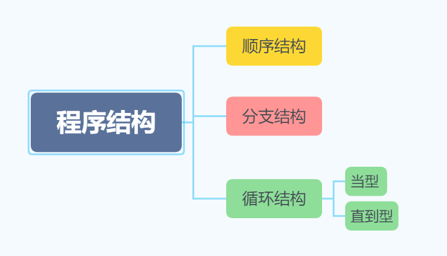

### 2. 流程控制与数组

#### 程序结构与流程控制

##### 程序结构图示：



**顺序结构：**自上往下逐行执行代码，中间没有控制跳转。

**分支结构：** 程序在此处根据逻辑选择一条支路流程执行。

**循环结构：** 程序中需要反复执行某个功能而设置的一种结构。循环结构又可分为两种形式：

​					1.先判断后执行的循环结构（当型）

​					2.先执行后判断的循环结构（直到型）


**Java中分支结构控制语句：**

`if` `else`

```java
if(loginControl){
	true-statement;
}else{
	false-statement;
}
```

`switch`

```java
switch (expressions){//此处表达式类型限制为：byte,short,char,int,枚举,Java.lang.String类
    case condition1 :
        condition1_statement;
        break;
    case condition2 :
        condition2_statement;
        break;
    default:
        conditionNotFound_statement;
}
```


##### Java中循环结构控制语句：

**当型：**先判断后执行


`for` 语句

```java
int sum = 0;
for (int i = 1; i < 11; i++) {
	sum += i;
}// sum的值为55；
```

`while` 语句

```java
int i = 1;
int sum = 0;
while (i < 11){
    sum += i;
    i++;
}// sum的值为55；
```


**直到型：** 先执行后判断


`do while` 语句

```java
int i = 1;
int sum = 0;
do {
	sum += i;
}while (i++ < 10);//当i>10 退出此循环；此时，sum的值为55；
```


#### 数组


##### 数组的定义

```java
type[] arrayName;
type arrayName[];
//定义数组时不能指定数组长度。
```


##### 数组的初始化

1. 静态初始化

   ```java
   arrayName = new type[]{ele0,ele1,...,eleN}
   ```

2. 动态初始化

   ```java
   type[] arrayName = new type[length];
   
   type[][] arrayName = new type[row][column];
   ```


**==注意点：==**

1. 不要同时使用静态初始化和动态初始化。
