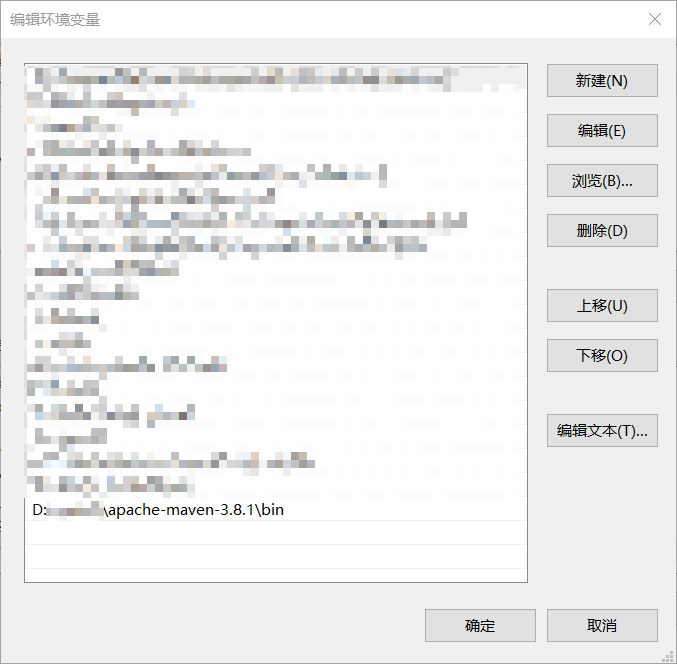

#### Maven下载安装配置

##### 1. 下载

地址：https://maven.apache.org/download.cgi

##### 2. 安装

解压即可：


##### 3. 配置

> 添加环境变量



> 新建文件夹`MavenRepository`

> 修改`conf`文件夹下的`settings.xml` 文件

在`settings` 标签下键入：

```xml
<localRepository>D:\MavenRepository</localRepository>
```

在`mirrors` 标签下键入：

```xml
<mirrors>
    <!-- mirror
     | Specifies a repository mirror site to use instead of a given repository. The repository that
     | this mirror serves has an ID that matches the mirrorOf element of this mirror. IDs are used
     | for inheritance and direct lookup purposes, and must be unique across the set of mirrors.
     |
    <mirror>
      <id>mirrorId</id>
      <mirrorOf>repositoryId</mirrorOf>
      <name>Human Readable Name for this Mirror.</name>
      <url>http://my.repository.com/repo/path</url>
    </mirror>
     -->
    <mirror>
		<id>aliyunmaven</id>
		<mirrorOf>*</mirrorOf>
		<name>阿里云公共仓库</name>
		<url>https://maven.aliyun.com/repository/public</url>
	</mirror>
	<mirror>
		<id>aliyunmaven</id>
		<mirrorOf>*</mirrorOf>
		<name>阿里云谷歌仓库</name>
		<url>https://maven.aliyun.com/repository/google</url>
	</mirror>
	<mirror>
		<id>aliyunmaven</id>
		<mirrorOf>*</mirrorOf>
		<name>阿里云阿帕奇仓库</name>
		<url>https://maven.aliyun.com/repository/apache-snapshots</url>
	</mirror>
	<mirror>
		<id>aliyunmaven</id>
		<mirrorOf>*</mirrorOf>
		<name>阿里云spring仓库</name>
		<url>https://maven.aliyun.com/repository/spring</url>
	</mirror>
	<mirror>
		<id>aliyunmaven</id>
		<mirrorOf>*</mirrorOf>
		<name>阿里云spring插件仓库</name>
		<url>https://maven.aliyun.com/repository/spring-plugin</url>
	</mirror>
	<mirror>
		<id>maven</id>
		<mirrorOf>*</mirrorOf>
		<name>maven仓库</name>
		<url>https://mvnrepository.com/</url>
	</mirror>
  </mirrors>
```

在`profiles` 标签下键入：

```xml
<profiles>
    <!-- profile
     | Specifies a set of introductions to the build process, to be activated using one or more of the
     | mechanisms described above. For inheritance purposes, and to activate profiles via <activatedProfiles/>
     | or the command line, profiles have to have an ID that is unique.
     |
     | An encouraged best practice for profile identification is to use a consistent naming convention
     | for profiles, such as 'env-dev', 'env-test', 'env-production', 'user-jdcasey', 'user-brett', etc.
     | This will make it more intuitive to understand what the set of introduced profiles is attempting
     | to accomplish, particularly when you only have a list of profile id's for debug.
     |
     | This profile example uses the JDK version to trigger activation, and provides a JDK-specific repo.
    <profile>
      <id>jdk-1.4</id>

      <activation>
        <jdk>1.4</jdk>
      </activation>

      <repositories>
        <repository>
          <id>jdk14</id>
          <name>Repository for JDK 1.4 builds</name>
          <url>http://www.myhost.com/maven/jdk14</url>
          <layout>default</layout>
          <snapshotPolicy>always</snapshotPolicy>
        </repository>
      </repositories>
    </profile>
    -->

    <!--
     | Here is another profile, activated by the system property 'target-env' with a value of 'dev',
     | which provides a specific path to the Tomcat instance. To use this, your plugin configuration
     | might hypothetically look like:
     |
     | ...
     | <plugin>
     |   <groupId>org.myco.myplugins</groupId>
     |   <artifactId>myplugin</artifactId>
     |
     |   <configuration>
     |     <tomcatLocation>${tomcatPath}</tomcatLocation>
     |   </configuration>
     | </plugin>
     | ...
     |
     | NOTE: If you just wanted to inject this configuration whenever someone set 'target-env' to
     |       anything, you could just leave off the <value/> inside the activation-property.
     |
    <profile>
      <id>env-dev</id>

      <activation>
        <property>
          <name>target-env</name>
          <value>dev</value>
        </property>
      </activation>

      <properties>
        <tomcatPath>/path/to/tomcat/instance</tomcatPath>
      </properties>
    </profile>
    -->
	<profile>     
		<id>JDK-1.8</id>       
		<activation>       
			<activeByDefault>true</activeByDefault>       
			<jdk>1.8<jdk>       
		</activation>       
		<properties>       
			<maven.compiler.source>1.8</maven.compiler.source>       
			<maven.compiler.target>1.8</maven.compiler.target>       
			<maven.compiler.compilerVersion>1.8</maven.compiler.compilerVersion>       
		</properties>
	</profile>
  </profiles>
```

即可。