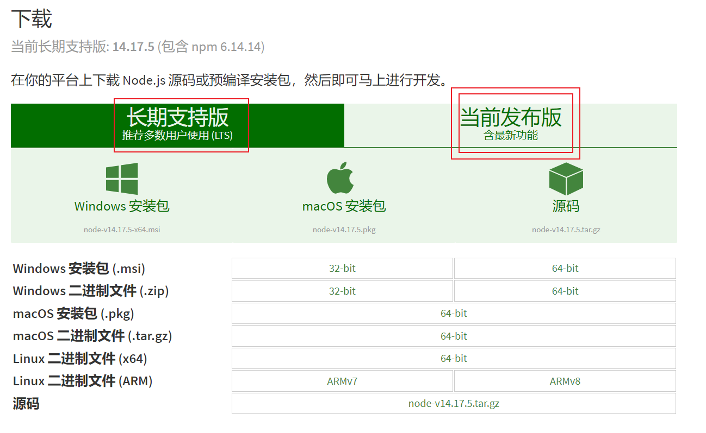
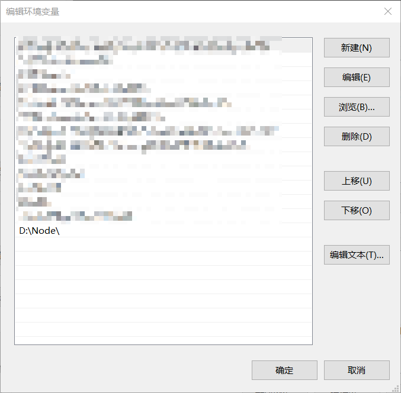
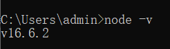
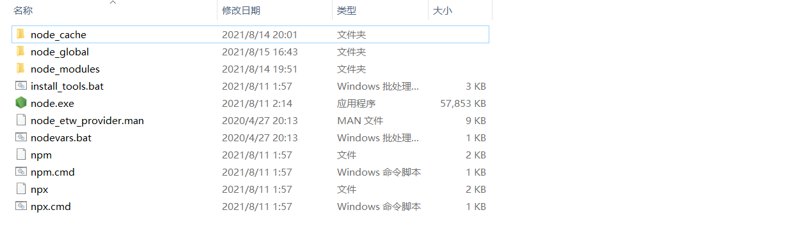
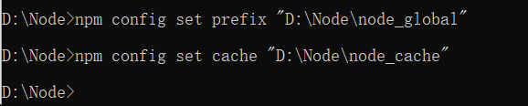

#### Node安装及配置

##### 1.下载

地址：https://nodejs.org/zh-cn/download/

追求稳定选择长期支持版本。（笔者选的最新版）

##### 2.安装

一路next即可。

如果你是解压版本（.zip）需要在当前系统添加环境变量。如下图：

在命令行键入：`node -v`	出现：

表示成功。

##### 3.配置

在Node安装的根目录新建两个文件夹`node_cache`	和`node_global`

如图：

打开命令行，键入`npm config set prefix "全路径"`	，`npm config set cache "全路径"`

然后，添加环境变量。

即可。