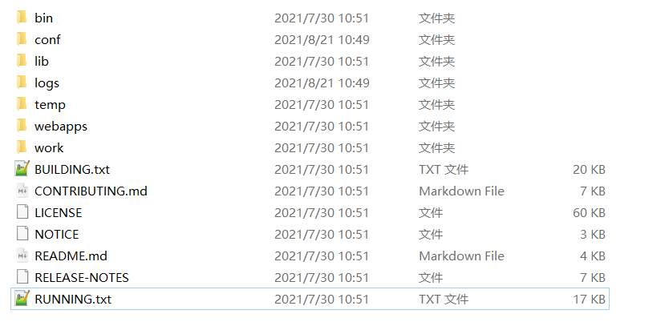

#### Tomcat目录结构

图示：

> bin : 存放Tomcat相关命令。
>
> conf : 存放Tomcat的配置。
>
> lib : 存放Tomcat的核心类库。
>
> log : 存放Tomcat运行日志。
>
> temp : 存放Web应用运行过程中生成的临时文件。
>
> webapps : 用于自动部署Web应用，将Web应用复制到该路径下，Tomcat会将该应用自动部署到容器中。
>
> work : 保存Web应用运行时编译生成的class文件。

